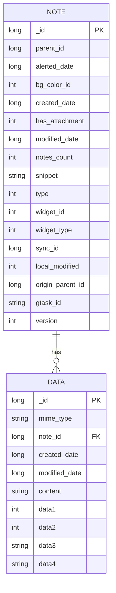
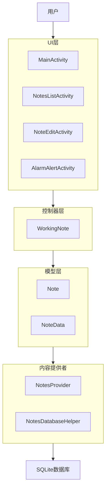
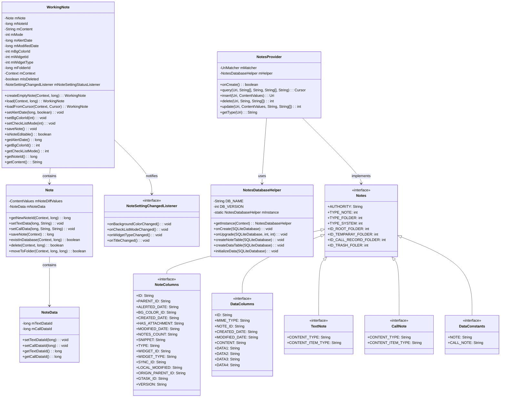
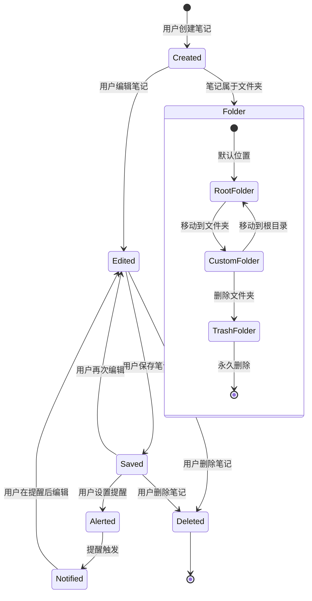

# MiNote数据模型分析

## 数据库模式

MiNote应用使用SQLite数据库进行数据持久化。数据库模式由两个主要表组成：

### 表结构



## 数据流图



## 详细类关系



## 序列图：创建和保存笔记

```mermaid
sequenceDiagram
    participant User as 用户
    participant NoteEditActivity
    participant WorkingNote
    participant Note
    participant NotesProvider
    participant Database as 数据库
    
    User->>NoteEditActivity: 创建新笔记
    NoteEditActivity->>WorkingNote: createEmptyNote()
    WorkingNote->>Note: getNewNoteId()
    Note->>NotesProvider: insert()
    NotesProvider->>Database: 插入笔记记录
    Database-->>NotesProvider: 返回笔记ID
    NotesProvider-->>Note: 返回笔记ID
    Note-->>WorkingNote: 返回笔记实例
    WorkingNote-->>NoteEditActivity: 返回工作笔记
    
    User->>NoteEditActivity: 编辑笔记内容
    NoteEditActivity->>WorkingNote: setContent()
    
    User->>NoteEditActivity: 保存笔记
    NoteEditActivity->>WorkingNote: saveNote()
    WorkingNote->>Note: saveNote()
    Note->>NotesProvider: update()
    NotesProvider->>Database: 更新笔记记录
    Database-->>NotesProvider: 成功/失败
    NotesProvider-->>Note: 成功/失败
    Note-->>WorkingNote: 成功/失败
    WorkingNote-->>NoteEditActivity: 成功/失败
```

## 状态图：笔记生命周期



## 数据访问模式分析

### CRUD操作

1. **创建(Create)**：
   - 通过`WorkingNote.createEmptyNote()`方法创建新笔记。
   - 这会生成一个新的笔记ID并在数据库中初始化一个笔记记录。
   - 实际内容在用户保存笔记时才会保存。

2. **读取(Read)**：
   - 通过`WorkingNote.load()`或`WorkingNote.loadFromCursor()`加载笔记。
   - `NotesProvider`处理各种过滤选项的查询。
   - 应用支持基于ID的直接查询和更复杂的过滤查询。

3. **更新(Update)**：
   - 笔记更新通过`WorkingNote.saveNote()`方法处理。
   - 该方法收集所有更改并将其传递给`Note.saveNote()`方法。
   - 然后通过`NotesProvider`将更改持久化到数据库。

4. **删除(Delete)**：
   - 笔记可以单独或批量删除。
   - `Note.delete()`方法处理单个删除。
   - 批量删除由`DataUtils.batchDeleteNotes()`方法处理。

### 数据关系

1. **笔记-数据关系**：
   - 笔记和数据记录之间存在一对多关系。
   - 每个笔记可以有多个数据记录(文本内容、通话信息等)。
   - 这通过数据库中的外键关系实现。

2. **笔记-文件夹层次结构**：
   - 笔记在层次文件夹结构中组织。
   - 笔记表中的`parent_id`字段建立了这种层次结构。
   - 特殊文件夹ID(根目录、垃圾箱等)被定义为常量。

## 性能考虑

1. **查询优化**：
   - 应用通过ContentProvider使用基于URI的查询。
   - 复杂查询通过SQLite数据库高效处理。
   - 然而，一些操作可以从更好的索引中受益。

2. **事务管理**：
   - 批量操作使用事务来提高性能。
   - 然而，并非所有应该是原子性的操作都被包装在事务中。

3. **内存管理**：
   - 大型笔记内容按需加载。
   - 然而，对频繁访问的数据缓存有限。

## 安全考虑

1. **数据验证**：
   - 对笔记内容和元数据的输入验证有限。
   - 在一些查询构建中可能存在SQL注入风险。

2. **访问控制**：
   - 没有笔记的用户级访问控制。
   - 所有笔记对任何有权访问应用的人都是可访问的。

3. **数据加密**：
   - 静态笔记数据没有加密。
   - 笔记中的敏感信息以明文存储。

## 数据模型改进建议

1. **现代化数据访问层**：
   - 用Room数据库替换ContentProvider，以获得更好的类型安全和查询构建。
   - 实现仓库模式来抽象数据访问。

2. **增强数据模型**：
   - 添加对富文本内容(HTML、markdown)的支持。
   - 实现标签/类别以便更好地组织。
   - 添加对附件(图像、文件)的支持。

3. **改进安全性**：
   - 为敏感笔记数据实现加密。
   - 为多用户场景添加用户认证。

4. **优化性能**：
   - 为频繁访问的笔记实现高效缓存。
   - 为大型笔记列表使用分页。
   - 用适当的索引优化数据库模式。

5. **添加数据完整性功能**：
   - 为笔记内容实现版本控制。
   - 为并发编辑添加冲突解决。
   - 改进备份和恢复功能。
