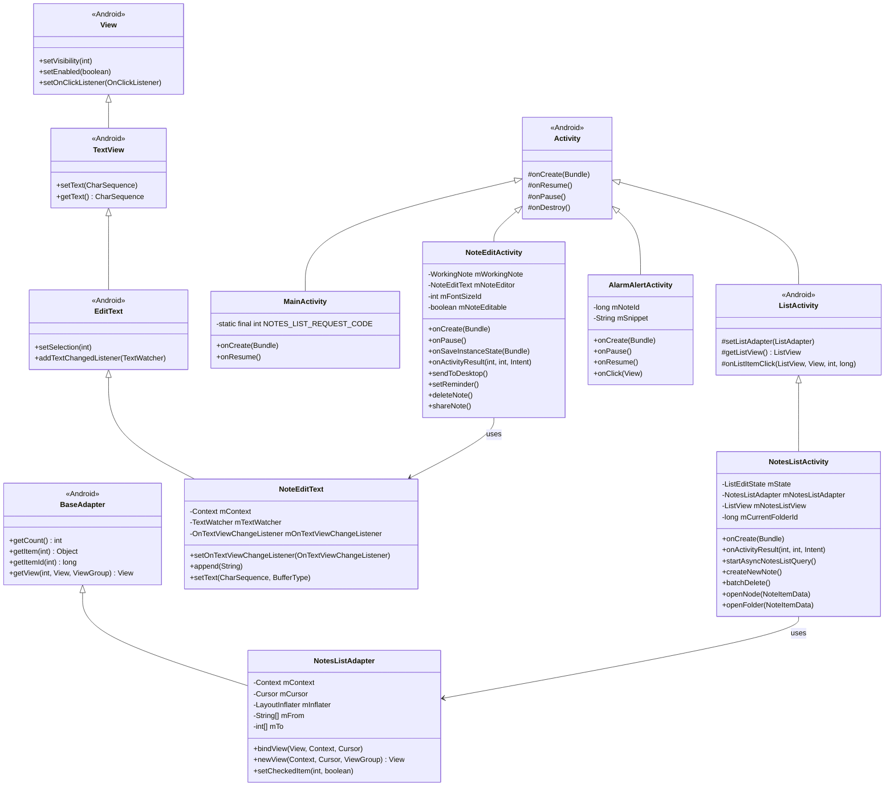

# MiNote UI组件分析

## UI架构概述

MiNote应用程序使用传统的Android UI架构，基于活动(Activity)和视图(View)组件。UI层与数据模型和业务逻辑有一定程度的分离，但在某些区域仍然存在紧密耦合。

### 主要UI组件

1. **活动(Activities)**：
   - `NotesListActivity`: 显示笔记列表和文件夹。
   - `NoteEditActivity`: 用于创建和编辑笔记。
   - `AlarmAlertActivity`: 显示笔记提醒。

2. **自定义视图(Custom Views)**：
   - `NoteEditText`: 用于笔记编辑的自定义EditText。
   - `FolderListItem`: 用于在列表中显示文件夹的自定义视图。

3. **适配器(Adapters)**：
   - `NotesListAdapter`: 将笔记数据绑定到列表视图。
   - `FoldersListAdapter`: 将文件夹数据绑定到列表视图。

4. **对话框(Dialogs)**：
   - 用于设置提醒、选择背景颜色和确认删除操作的各种对话框。

## 活动流程图

## UI组件类图

## UI组件交互序列

### 创建新笔记序列

### 设置提醒序列

## 自定义视图组件分析

### NoteEditText

`NoteEditText`是一个扩展自Android标准`EditText`的自定义视图，专为笔记编辑而设计。

**主要特性**：
- 支持文本变化监听
- 自定义文本格式化
- 支持清单模式(带复选框的项目列表)

**关键方法**：
- `setOnTextViewChangeListener()`: 设置文本变化监听器
- `append()`: 添加文本，同时触发监听器
- `setText()`: 设置文本，同时触发监听器

### 其他自定义视图

1. **NoteItemView**: 用于在列表中显示笔记项目的自定义视图。
2. **FolderItemView**: 用于在列表中显示文件夹项目的自定义视图。

## UI布局结构

MiNote使用XML布局文件定义其UI结构。主要布局包括：

1. **notes_list.xml**: 笔记列表活动的主布局
   - 包含一个ListView用于显示笔记
   - 包含操作按钮(新建笔记、删除等)

2. **note_edit.xml**: 笔记编辑活动的主布局
   - 包含NoteEditText用于编辑笔记内容
   - 包含格式化工具栏

3. **note_item.xml**: 笔记列表项目的布局
   - 显示笔记标题/片段
   - 显示创建/修改日期
   - 显示提醒图标(如果设置了提醒)

4. **folder_item.xml**: 文件夹列表项目的布局
   - 显示文件夹名称
   - 显示文件夹中的笔记数量

## UI状态管理

### 活动状态管理

1. **NotesListActivity**：
   - 使用`ListEditState`枚举管理不同的列表状态(正常、编辑、选择)
   - 在配置变化(如屏幕旋转)时保存和恢复状态

2. **NoteEditActivity**：
   - 在`onSaveInstanceState()`中保存笔记内容和光标位置
   - 在`onCreate()`中恢复保存的状态

### 视图状态管理

1. **笔记编辑状态**：
   - 通过`WorkingNote`类跟踪笔记的编辑状态
   - 使用`NoteSettingChangedListener`接口通知UI状态变化

2. **列表选择状态**：
   - 通过`NotesListAdapter`中的选择跟踪机制管理
   - 支持多选操作(批量删除、移动到文件夹)

## UI事件处理

### 用户输入处理

1. **触摸事件**：
   - 通过标准Android触摸事件监听器处理
   - 支持长按操作(如在列表中选择项目)

2. **文本输入**：
   - 通过`TextWatcher`接口监听文本变化
   - 在`NoteEditText`中自定义处理文本输入

### 菜单处理

1. **选项菜单**：
   - 通过`onCreateOptionsMenu()`和`onOptionsItemSelected()`方法处理
   - 根据当前上下文动态更改菜单项

2. **上下文菜单**：
   - 通过`onCreateContextMenu()`和`onContextItemSelected()`方法处理
   - 用于笔记列表中的项目特定操作

## UI主题和样式

MiNote使用自定义主题和样式来定义其视觉外观：

1. **颜色主题**：
   - 为笔记提供多种背景颜色选项
   - 使用主题属性定义全局颜色方案

2. **文本样式**：
   - 支持不同的字体大小设置
   - 使用样式资源定义文本外观

## 小部件支持

MiNote提供主屏幕小部件功能：

1. **笔记小部件**：
   - 显示单个笔记内容
   - 点击时打开相应的笔记进行编辑

2. **小部件配置**：
   - 通过`AppWidgetProvider`实现
   - 支持调整大小和更新内容

## UI改进建议

1. **现代化UI设计**：
   - 实现Material Design指南
   - 添加动画和过渡效果
   - 改进导航模式(如使用导航抽屉)

2. **增强用户体验**：
   - 添加拖放支持进行笔记组织
   - 实现手势识别进行常见操作
   - 添加深色主题支持

3. **提高可访问性**：
   - 改进屏幕阅读器支持
   - 添加更多字体大小选项
   - 实现高对比度主题

4. **响应式布局**：
   - 优化不同屏幕尺寸的布局
   - 改进平板电脑和大屏幕设备的支持
   - 实现多窗口支持

5. **现代UI组件**：
   - 使用RecyclerView替换ListView
   - 实现ConstraintLayout进行更灵活的布局
   - 使用Fragment进行更模块化的UI设计

MiNote的UI组件展示了传统Android UI架构的实现，具有清晰的活动流程和自定义视图组件。虽然功能齐全，但UI可以通过采用现代Android UI实践和设计模式进行现代化，以提高用户体验和可维护性。主要改进领域包括实现Material Design、增强响应式布局和使用更现代的UI组件。
