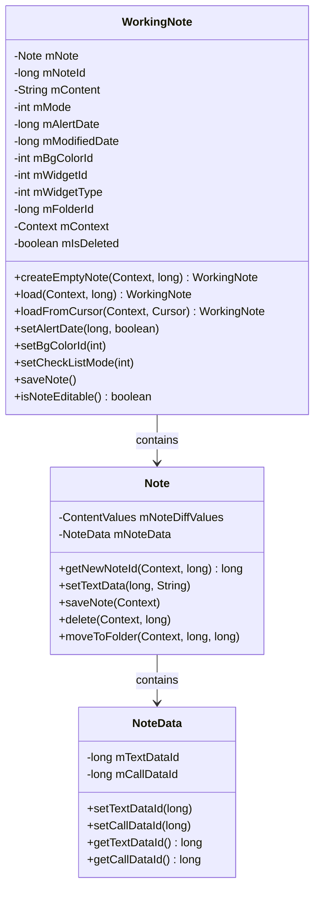
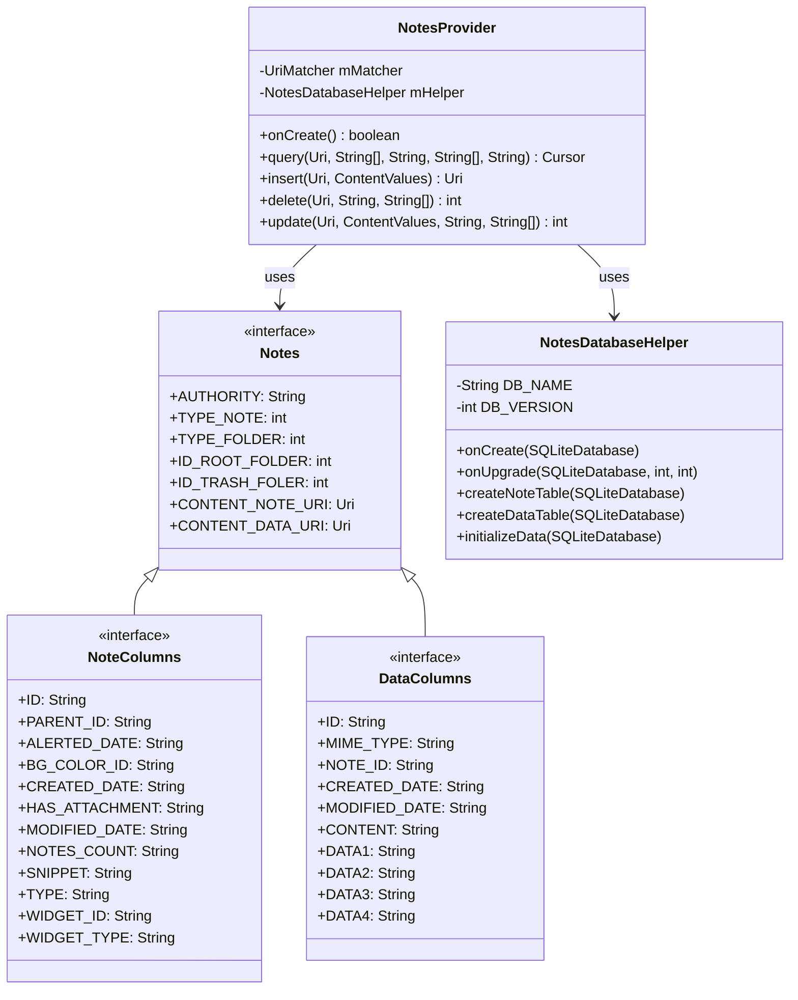
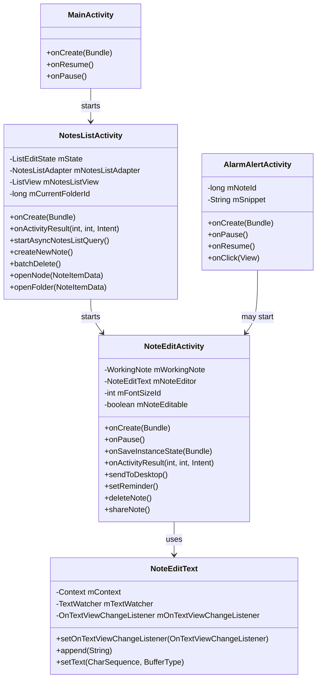
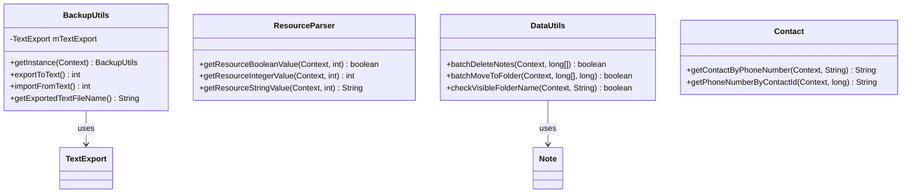

# MiNote应用架构分析

## 概述

MiNote是一款Android笔记应用，允许用户创建、编辑、组织和管理笔记。该应用遵循传统的Android架构，在UI组件、数据模型和数据访问层之间有明确的分离。

## UML类图

### 核心模型类

### 数据访问层

### UI组件

### 工具类

## 架构分析

### 设计模式分析

1. **MVC架构模式**:
   - **模型(Model)**: `Note`、`WorkingNote`和`NoteData`类代表数据模型。
   - **视图(View)**: 活动(Activity)和自定义视图如`NoteEditText`代表UI。
   - **控制器(Controller)**: 活动也作为控制器，处理用户输入并更新模型。

2. **单例模式**:
   - 在`BackupUtils`中使用，确保只存在一个实例。
   - 在`NotesDatabaseHelper`中用于数据库访问。

3. **观察者模式**:
   - 通过如`NoteSettingChangedListener`等接口实现，通知组件变化。
   - 用于在笔记数据变化时更新UI。

4. **内容提供者模式**:
   - `NotesProvider`实现Android的内容提供者模式进行数据访问。
   - 为笔记数据的CRUD操作提供标准化接口。

### 优势

1. **关注点分离清晰**:
   - 数据模型(`Note`、`WorkingNote`)与UI组件分离。
   - 数据访问层(`NotesProvider`、`NotesDatabaseHelper`)封装良好。

2. **灵活的数据模型**:
   - 支持不同的笔记类型(文本笔记、通话笔记)。
   - 具有文件夹的层次组织。

3. **全面的功能**:
   - 带格式选项的笔记编辑。
   - 提醒和警报。
   - 备份和恢复功能。
   - 主屏幕的小部件支持。

4. **可扩展性**:
   - 架构允许添加新的笔记类型。
   - UI组件可以扩展以增加额外功能。

### 弱点

1. **某些领域的紧密耦合**:
   - UI组件经常直接访问数据模型。
   - 活动包含过多的业务逻辑。

2. **传统架构**:
   - 不使用现代Android架构组件(ViewModel、LiveData、Room)。
   - 过度依赖ContentProvider，这在现代Android开发中不太常见。

3. **有限的错误处理**:
   - 在许多关键操作中异常处理很少。
   - 缺乏全面的错误恢复机制。

4. **性能考虑**:
   - 大型数据操作并不总是异步执行。
   - 数据库操作期间可能阻塞UI。

## 改进建议

1. **现代化架构**:
   - 使用Android架构组件实现MVVM架构。
   - 用Room数据库替换ContentProvider进行数据持久化。
   - 使用LiveData或Flow进行响应式UI更新。

2. **增强用户体验**:
   - 更新UI以遵循Material Design指南。
   - 实现更直观的导航模式。
   - 添加对富文本编辑和多媒体内容的支持。

3. **提高代码质量**:
   - 通过更好的抽象减少代码重复。
   - 实现全面的错误处理。
   - 为关键组件添加单元和集成测试。

4. **添加现代功能**:
   - 笔记的云同步。
   - 语音输入和语音转文本。
   - 增强的搜索功能。
   - 协作功能。

MiNote展示了一个结构良好的Android应用程序，在数据模型、UI组件和数据访问层之间有明确的分离。虽然它遵循传统的Android开发模式，但可以通过现代化来融合当代架构组件和设计模式而受益。该应用程序提供了一个坚实的基础，可以通过现代功能进行扩展，以增强用户体验和可维护性。
